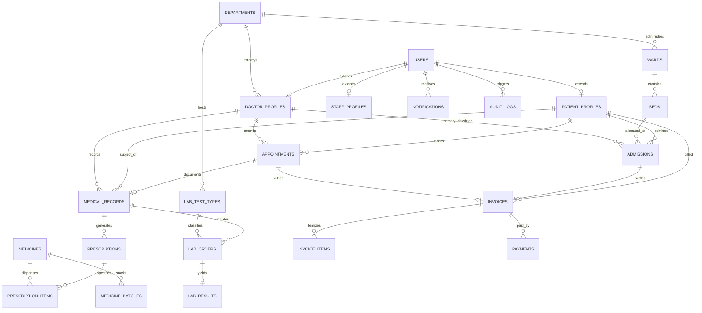
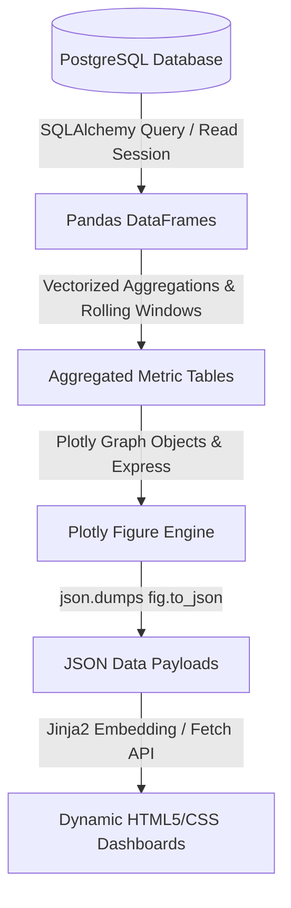
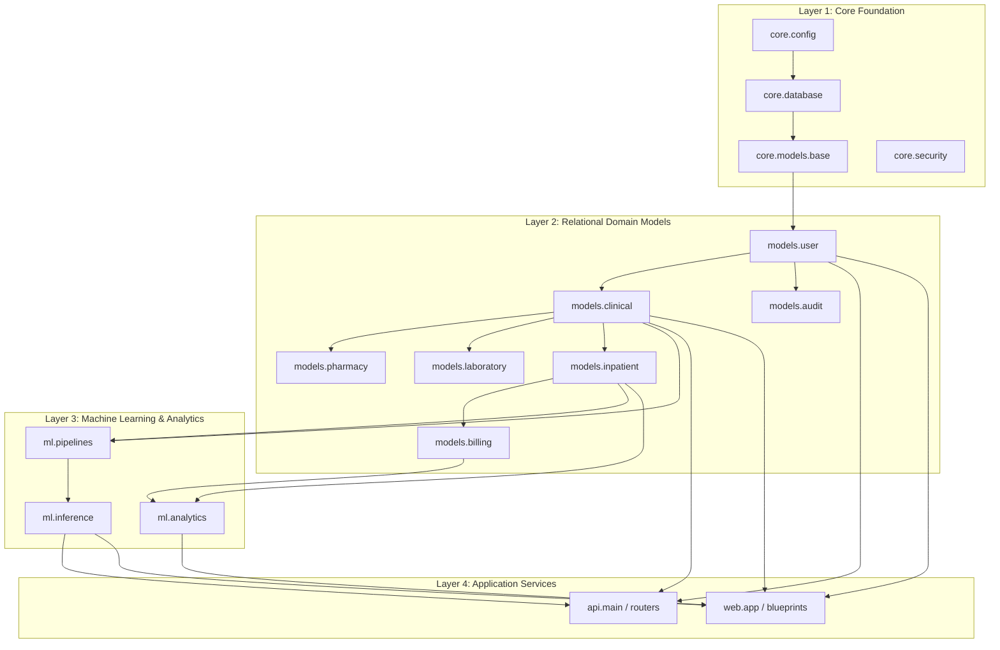

# CHIKITSASETU - Smart Hospital Management & Healthcare Analytics System
## System Architecture & Technical Specification Document

> **Comprehensive Project Specification & Technical Blueprint**  
> **Target Discipline:** Healthcare Informatics, Clinical Operations & Predictive Machine Learning  
> **Architectural Standard:** Tier-Decoupled Python Hybrid Architecture (Flask UI + FastAPI Service + Scikit-Learn ML Subsystem + PostgreSQL)

---

## Table of Contents
1. [Executive Summary & Requirements Analysis](#1-executive-summary--requirements-analysis)
2. [Quickstart & Local Setup Guide (Windows / PowerShell)](#2-quickstart--local-setup-guide-windows--powershell)
3. [High-Level System Architecture](#3-high-level-system-architecture)
4. [Database Architecture & Entity-Relationship Design](#4-database-architecture--entity-relationship-design)
5. [Role-Based Access Control (RBAC) Matrix](#5-role-based-access-control-rbac-matrix)
6. [Flask Presentation & Workflow Architecture](#6-flask-presentation--workflow-architecture)
7. [FastAPI High-Performance Service Architecture](#7-fastapi-high-performance-service-architecture)
8. [Machine Learning & Predictive Analytics Architecture](#8-machine-learning--predictive-analytics-architecture)
9. [Hospital Analytics & Business Intelligence Engine](#9-hospital-analytics--business-intelligence-engine)
10. [Module Dependency Analysis & Data Flow DAG](#10-module-dependency-analysis--data-flow-dag)
11. [Security, Audit & Compliance Architecture](#11-security-audit--compliance-architecture)
12. [Testing & Quality Assurance Strategy](#12-testing--quality-assurance-strategy)
13. [Docker Deployment & Infrastructure Topology](#13-docker-deployment--infrastructure-topology)
14. [Phase-by-Phase Development Roadmap](#14-phase-by-phase-development-roadmap)
15. [CHIKITSASETU AI Health Assistant](#15-chikitsasetu-ai-health-assistant)

---

## 1. Executive Summary & Requirements Analysis

Modern healthcare facilities struggle with fragmented software stacks where operational workflows (appointments, billing, inpatient admissions, electronic medical records) are disconnected from predictive machine learning and operational analytics. **CHIKITSASETU** is designed to address this challenge by delivering an enterprise-grade hospital management platform with integrated real-time machine learning inference and interactive operational intelligence.

### 1.1 Requirements Traceability Matrix

The system satisfies 30 functional and non-functional requirements without introducing external languages or bloated frameworks:

| Req # | Requirement Area | System Component | Technical Implementation |
|:---:|:---|:---|:---|
| **1** | Authentication | Core / Web / API | Bcrypt salted hashing, HTTP-only session cookies (Flask), JWT bearer tokens (FastAPI). |
| **2** | Role-Based Access Control (RBAC) | Core Security | 7 distinct operational roles enforced via decorators (`@roles_required`) and API dependencies. |
| **3** | Admin Management | Flask Blueprint / API | System configuration, staff provisioning, audit inspection, department allocation. |
| **4** | Doctor Management & Portal | Flask Blueprint / API | OPD consultation queue, clinical notes authoring, lab ordering, electronic prescriptions. |
| **5** | Patient Portal | Flask Blueprint / API | Profile management, appointment history, lab reports access, prescription view, bill payment. |
| **6** | Receptionist Portal | Flask Blueprint / API | Walk-in registration, appointment scheduling, token generation, bed assignment lookup. |
| **7** | Nurse Portal | Flask Blueprint / API | Inpatient ward roster, vital signs monitoring, bed occupancy status, intake assistance. |
| **8** | Pharmacist Portal | Flask Blueprint / API | Prescription queue, medication dispensing, batch inventory tracking, reorder thresholds. |
| **9** | Laboratory Technician Portal | Flask Blueprint / API | Specimen logging, test execution, parameter entry, abnormal flag tagging, report verification. |
| **10** | Patient Management | Core / Web / API | Master patient index (MPI), demographics, chronic conditions, emergency contacts. |
| **11** | Doctor Management | Core / Web / API | Medical credentials, department affiliation, room assignment, OPD schedule matrix. |
| **12** | Department Management | Core / Web / API | Clinical departments, head of department mapping, operational unit statistics. |
| **13** | Appointment Management | Core / Web / API | Booking, rescheduling, token generation, status transitions, no-show scoring. |
| **14** | Medical Records (EMR/EHR) | Core / Web / API | Longitudinal patient records, ICD-aligned diagnosis notes, consultation histories. |
| **15** | Prescription Management | Core / Web / API | Structured dosage, frequency, course duration, dispensing status lifecycles. |
| **16** | Laboratory Management | Core / Web / API | Test catalog, specimen collection, quantitative lab results, reference range evaluation. |
| **17** | Pharmacy Operations | Core / Web / API | Prescription fulfillment, drug lookup, unit dispensation, pharmacy invoice line-items. |
| **18** | Inventory Management | Core / Web / API | Batch tracking, expiration date monitoring, automated low-stock warnings. |
| **19** | Admission & Discharge (IPD) | Core / Web / API | Inpatient admission lifecycles, clinical handover, discharge summaries, clearance workflows. |
| **20** | Bed Management | Core / Web / API | Ward categorization (ICU, General, Emergency), real-time occupancy grid, bed rate tracking. |
| **21** | Billing & Invoicing | Core / Web / API | Consolidated invoices (consultations, lab tests, bed charges, pharmacy), payments, receipts. |
| **22** | Notifications & Alerts | Core / Web / API | Critical lab value alerts, low inventory notices, appointment reminder alerts. |
| **23** | Audit Logging | Core / Web / API | Immutable audit log capturing mutating user actions, IP addresses, resource IDs, and timestamps. |
| **24** | Hospital Analytics | Analytics Subsystem | Pandas data pipelines driving interactive Plotly visualizations across clinical and financial domains. |
| **25** | ML Risk Prediction | ML Subsystem | Scikit-Learn 30-day inpatient readmission and clinical deterioration classifier. |
| **26** | Appointment No-Show Prediction | ML Subsystem | Scikit-Learn probabilistic classifier predicting missed appointments with triage indicators. |
| **27** | FastAPI REST APIs | API Subsystem | High-throughput asynchronous REST endpoints with Pydantic validation and OpenAPI docs. |
| **28** | ML APIs | API Subsystem | Dedicated `/api/v1/predict/...` endpoints for real-time inference serving. |
| **29** | Automated Testing | Pytest Suite | Unit tests, integration workflows, API contract validation, mock DB fixtures. |
| **30** | Docker Deployment | Infrastructure | Multi-container Docker Compose setup (`web`, `api`, `db`, persistent volumes). |

---

## 2. Quickstart & Local Setup Guide (Windows / PowerShell)

### 2.1 Prerequisites
- **Python**: 3.11+ (Python 3.11, 3.12, or 3.13)
- **Git**
- **Windows PowerShell**
- *(Optional for Containerized Deployment)*: Docker Desktop & PostgreSQL 15+

---

### 2.2 Local Environment Setup

Open PowerShell and navigate to the project directory:

```powershell
# 1. Navigate to project root
cd D:\CHIKITSASETU

# 2. Create isolated virtual environment
python -m venv .venv

# 3. Activate virtual environment
.venv\Scripts\Activate.ps1

# 4. Install all dependencies
pip install -r requirements.txt
```

---

### 2.3 Configuration Setup

Copy the environment template to create your local `.env`:

```powershell
# Copy template configuration
Copy-Item .env.example .env
```

Default settings in `.env` are configured for immediate, zero-configuration local development using standalone SQLite (`chikitsasetu_dev.db`).

> [!NOTE]
> For production deployments, set `ENV=production`, configure a high-entropy `SECRET_KEY`, and provide your PostgreSQL connection in `DATABASE_URL`. In production mode, the application strictly forbids SQLite fallback.

---

### 2.4 Database Setup & Alembic Migrations

Run Alembic migrations to apply the relational schema:

```powershell
# Check migration head status
alembic current
alembic heads

# Upgrade database to latest schema revision
alembic upgrade head

# Verify models and database schema match 100%
alembic check
```

---

### 2.5 Seed Realistic Clinical Demo Data (DEVELOPMENT ONLY)

Populate the database with clinical departments, roles, doctors, patient records, inventory, and bed wards:

```powershell
# Seed local development database
python scripts/seed_database.py
```

> [!CAUTION]
> `seed_database.py` is for local development only and automatically aborts if run in `ENV=production`.

---

### 2.6 Running the Services Locally

#### Option A: Run Both Services Simultaneously (Recommended)
```powershell
# Launches both Flask (port 5000) and FastAPI (port 8000) concurrently
python run_all.py
```
*(Or double-click `run.bat` in File Explorer).*

#### Option B: Run Flask Web Portal Separately
```powershell
python run_flask.py
```
- Web Portal URL: `http://127.0.0.1:5000`
- Login Page: `http://127.0.0.1:5000/login`
- Health Endpoint: `http://127.0.0.1:5000/health`

#### Option C: Run FastAPI REST & ML Inference Service Separately
```powershell
python run_fastapi.py
```
- API Base URL: `http://127.0.0.1:8000`
- Interactive Swagger UI: `http://127.0.0.1:8000/docs`
- ReDoc API Documentation: `http://127.0.0.1:8000/redoc`
- Health Endpoint: `http://127.0.0.1:8000/health`

---

### 2.7 Automated Testing

Execute the complete 331-item automated test suite:

```powershell
# Run entire test suite
pytest -q

# Run focused security & hardening audit suite
pytest tests/security/ -v

# Run unit tests
pytest tests/unit/ -v

# Run REST API contract tests
pytest tests/api/ -v
```

---

### 2.8 Docker Deployment

To spin up the containerized architecture with PostgreSQL, FastAPI, and Flask:

```powershell
# Build and start all three container services
docker compose up --build -d

# Verify container health
docker compose ps

# View container logs
docker compose logs -f
```

---

### 2.9 AI Health Assistant & Multimodal Chatbot

The AI Health Assistant is available on all authenticated portal pages via the floating widget at the bottom right.
- **Offline Mode (Default)**: Clinical extraction engine operating without external API keys.
- **Gemini Multimodal Mode**: Set `CHATBOT_PROVIDER=gemini` and provide `CHATBOT_API_KEY=your_gemini_key` in `.env`.
- **Security & Privacy**:
  - Unauthenticated requests are rejected with HTTP 401.
  - Context is bound to authenticated user claims. Patients cannot access other patients' data.
  - Uploaded files are validated via magic bytes and stored with randomized UUID filenames.
  - API keys remain strictly server-side.

---

### 2.10 Security & Safe GitHub Push Commands

To safely publish your repository to GitHub:

```powershell
# 1. Verify working tree status and confirm .env is ignored
git status

# 2. Review modified files
git diff --stat

# 3. Stage verified project changes
git add .

# 4. Commit with descriptive summary
git commit -m "Harden security, authenticate chatbot, synchronize migrations, and remove default credentials"

# 5. Push to GitHub
git push origin main
```

---

## 3. High-Level System Architecture

CHIKITSASETU utilizes a **Hybrid Python Two-Tier Architecture** centered around a shared relational domain model in PostgreSQL.

```
                              +-------------------------------------------+
                              |         Client Interfaces & Devices       |
                              |  - Desktop Browsers  - Mobile Browsers    |
                              +-------------------------------------------+
                                     |                             |
                       (HTTP / HTML / Dynamic JS)          (REST / JSON API)
                                     |                             |
                                     v                             v
+---------------------------------------------------+  +---------------------------------------------------+
|               FLASK PRESENTATION LAYER            |  |             FASTAPI HIGH-SPEED API LAYER          |
|                   (Gunicorn / :5000)              |  |                  (Uvicorn / :8000)                |
+---------------------------------------------------+  +---------------------------------------------------+
| - Application Factory Pattern                     |  | - OpenAPI / Interactive Swagger Docs (/docs)      |
| - 10 Modular Blueprints (Auth, Portals, Admin)    |  | - High-Throughput Asynchronous Endpoints          |
| - Jinja2 Server-Side Templates                    |  | - Pydantic V2 Request / Response Serialization    |
| - Custom Glassmorphic CSS Design System           |  | - Dependency Injection (DB, Security, Roles)      |
| - Vanilla JS Dynamic Form Handlers                |  | - Real-Time ML Inference Serving Engine           |
| - Embedded Plotly Interactive Dashboards          |  | - Microservice Interoperability Interface         |
| - Secure Session Management & CSRF Guards         |  | - Direct Connection Pooling to Database          |
+---------------------------------------------------+  +---------------------------------------------------+
                         |                                                     |
                         |               SHARED DOMAIN MODEL                   |
                         +------------------------+----------------------------+
                                                  |
                                                  v
                      +----------------------------------------------------+
                      |               CORE PERSISTENCE LAYER               |
                      |            (SQLAlchemy ORM + PostgreSQL 15)        |
                      +----------------------------------------------------+
                      | - Single Source of Truth (core/models/)            |
                      | - ScopedSession Engine Pools (Sync & Async)        |
                      | - ACID Enforced Relationships & Foreign Keys       |
                      | - Automated Timestamping & Mutation Hooks          |
                      +----------------------------------------------------+
                                                  ^
                                                  |
                         +------------------------+----------------------------+
                         |                                                     |
                         v                                                     v
+---------------------------------------------------+  +---------------------------------------------------+
|            MACHINE LEARNING SUBSYSTEM             |  |            ANALYTICS & BI SUBSYSTEM               |
|          (Scikit-Learn / NumPy / Joblib)          |  |                (Pandas / Plotly)                  |
+---------------------------------------------------+  +---------------------------------------------------+
| - Clinical Readmission Prediction Model           |  | - Inpatient Bed Occupancy & Turnaround Visuals    |
| - Appointment No-Show Classifier                  |  | - Outpatient Volume & Waiting Time Analytics      |
| - Serialized Sklearn Pipelines (.joblib)          |  | - Departmental Revenue & Cashflow Heatmaps        |
| - Automated Preprocessing & Calibration           |  | - Pharmacy Inventory Velocity & Expiry Matrices   |
| - Feature Contribution / Explanations             |  | - Headless JSON Generation for Frontend Plotly    |
+---------------------------------------------------+  +---------------------------------------------------+
```

### 2.1 Architectural Justifications for the Data Science Stack
1. **Flask for the Presentation Tier**: Flask offers granular control over server-rendered templates, fine-grained session control, and zero-overhead integration with Python-based data structures (such as passing Plotly figure dictionaries directly into Jinja2 templates without Node.js tooling).
2. **FastAPI for the Service Tier**: High-concurrency asynchronous endpoints, automatic JSON schema generation via Pydantic, and native support for low-latency machine learning inference pipelines.
3. **Shared Core Domain (`core/`)**: By housing database models, base repositories, and security hashing functions inside `core/`, neither Flask nor FastAPI duplicates database schemas, completely avoiding schema drift.
4. **Scikit-learn Pipelines**: Preprocessing, categorical encoding, feature scaling, and estimators are bundled inside single serialized `Pipeline` artifacts, preventing train-test data leakage and guaranteeing reproducible inference in production.

---

## 3. Database Architecture & Entity-Relationship Design

The relational database comprises 20 core tables structured into 6 normalized clinical domains.



### 3.1 Entity Catalog & Detailed Schema Specifications

#### A. Identity & Core Access
1. **`users`**
   - `id`: Integer, Primary Key, Auto-increment.
   - `email`: Varchar(255), Unique, Indexed, Not Null.
   - `password_hash`: Varchar(255), Not Null.
   - `role`: Enum(`admin`, `doctor`, `patient`, `receptionist`, `nurse`, `pharmacist`, `lab_tech`), Indexed, Not Null.
   - `first_name`: Varchar(100), Not Null.
   - `last_name`: Varchar(100), Not Null.
   - `phone`: Varchar(20), Nullable.
   - `is_active`: Boolean, Default `True`.
   - `created_at`: DateTime(timezone=True), Server Default `now()`.
   - `updated_at`: DateTime(timezone=True), OnUpdate `now()`.

2. **`doctor_profiles`**
   - `user_id`: Integer, Primary Key, Foreign Key (`users.id`, ondelete='CASCADE').
   - `department_id`: Integer, Foreign Key (`departments.id`), Not Null.
   - `specialization`: Varchar(120), Not Null.
   - `license_number`: Varchar(60), Unique, Not Null.
   - `consultation_fee`: Numeric(10, 2), Not Null, Default 500.00.
   - `qualification`: Varchar(150), Not Null.
   - `room_number`: Varchar(20), Nullable.
   - `available_days`: Varchar(50), Default 'Mon,Tue,Wed,Thu,Fri'.

3. **`patient_profiles`**
   - `user_id`: Integer, Primary Key, Foreign Key (`users.id`, ondelete='CASCADE').
   - `dob`: Date, Not Null.
   - `gender`: Enum(`male`, `female`, `other`), Not Null.
   - `blood_group`: Enum(`A+`, `A-`, `B+`, `B-`, `AB+`, `AB-`, `O+`, `O-`), Nullable.
   - `emergency_contact_name`: Varchar(120), Nullable.
   - `emergency_contact_phone`: Varchar(20), Nullable.
   - `address`: Text, Nullable.
   - `allergies`: Text, Nullable.
   - `chronic_conditions`: Text, Nullable.

4. **`staff_profiles`**
   - `user_id`: Integer, Primary Key, Foreign Key (`users.id`, ondelete='CASCADE').
   - `department_id`: Integer, Foreign Key (`departments.id`), Nullable.
   - `employee_id`: Varchar(50), Unique, Not Null.
   - `designation`: Varchar(100), Not Null.
   - `shift`: Enum(`morning`, `evening`, `night`, `rotating`), Default `morning`.

#### B. Department & Clinical Records
5. **`departments`**
   - `id`: Integer, Primary Key, Auto-increment.
   - `name`: Varchar(100), Unique, Not Null.
   - `code`: Varchar(10), Unique, Not Null.
   - `description`: Text, Nullable.
   - `head_doctor_id`: Integer, Foreign Key (`users.id`), Nullable.
   - `is_active`: Boolean, Default `True`.

6. **`appointments`**
   - `id`: Integer, Primary Key, Auto-increment.
   - `patient_id`: Integer, Foreign Key (`patient_profiles.user_id`), Not Null.
   - `doctor_id`: Integer, Foreign Key (`doctor_profiles.user_id`), Not Null.
   - `appointment_datetime`: DateTime(timezone=True), Indexed, Not Null.
   - `status`: Enum(`scheduled`, `confirmed`, `completed`, `cancelled`, `no_show`), Default `scheduled`.
   - `reason`: Text, Nullable.
   - `token_number`: Integer, Not Null.
   - `no_show_probability`: Float, Nullable (populated by ML model).
   - `created_at`: DateTime(timezone=True), Server Default `now()`.

7. **`medical_records`**
   - `id`: Integer, Primary Key, Auto-increment.
   - `patient_id`: Integer, Foreign Key (`patient_profiles.user_id`), Not Null.
   - `doctor_id`: Integer, Foreign Key (`doctor_profiles.user_id`), Not Null.
   - `appointment_id`: Integer, Foreign Key (`appointments.id`), Nullable.
   - `visit_date`: Date, Not Null.
   - `symptoms`: Text, Not Null.
   - `diagnosis`: Text, Not Null.
   - `clinical_notes`: Text, Nullable.
   - `vitals_bp`: Varchar(20), Nullable (e.g. "120/80").
   - `vitals_pulse`: Integer, Nullable.
   - `vitals_temp`: Numeric(4, 1), Nullable.
   - `vitals_spo2`: Integer, Nullable.
   - `follow_up_date`: Date, Nullable.
   - `created_at`: DateTime(timezone=True), Server Default `now()`.

#### C. Pharmacy & Inventory
8. **`medicines`**
   - `id`: Integer, Primary Key, Auto-increment.
   - `name`: Varchar(150), Indexed, Not Null.
   - `generic_name`: Varchar(150), Indexed, Nullable.
   - `category`: Varchar(100), Not Null (e.g. Antibiotic, Analgesic).
   - `unit`: Varchar(30), Not Null (e.g. Tablet, Syrup, Ampoule).
   - `unit_price`: Numeric(10, 2), Not Null.
   - `reorder_level`: Integer, Default 20, Not Null.
   - `manufacturer`: Varchar(120), Nullable.

9. **`medicine_batches`**
   - `id`: Integer, Primary Key, Auto-increment.
   - `medicine_id`: Integer, Foreign Key (`medicines.id`, ondelete='CASCADE'), Not Null.
   - `batch_number`: Varchar(60), Not Null.
   - `expiry_date`: Date, Indexed, Not Null.
   - `quantity_in_stock`: Integer, Not Null, Default 0.
   - `purchase_cost`: Numeric(10, 2), Not Null.
   - `received_date`: Date, Server Default `now()`.

10. **`prescriptions`**
    - `id`: Integer, Primary Key, Auto-increment.
    - `medical_record_id`: Integer, Foreign Key (`medical_records.id`), Not Null.
    - `patient_id`: Integer, Foreign Key (`patient_profiles.user_id`), Not Null.
    - `doctor_id`: Integer, Foreign Key (`doctor_profiles.user_id`), Not Null.
    - `status`: Enum(`pending`, `dispensed`, `partially_dispensed`), Default `pending`.
    - `notes`: Text, Nullable.
    - `created_at`: DateTime(timezone=True), Server Default `now()`.

11. **`prescription_items`**
    - `id`: Integer, Primary Key, Auto-increment.
    - `prescription_id`: Integer, Foreign Key (`prescriptions.id`, ondelete='CASCADE'), Not Null.
    - `medicine_id`: Integer, Foreign Key (`medicines.id`), Not Null.
    - `dosage`: Varchar(50), Not Null (e.g. "500mg").
    - `frequency`: Varchar(50), Not Null (e.g. "1-0-1 after meals").
    - `duration_days`: Integer, Not Null.
    - `quantity_prescribed`: Integer, Not Null.
    - `quantity_dispensed`: Integer, Default 0.

#### D. Laboratory Diagnostics
12. **`lab_test_types`**
    - `id`: Integer, Primary Key, Auto-increment.
    - `name`: Varchar(120), Unique, Not Null.
    - `test_code`: Varchar(20), Unique, Not Null (e.g. "CBC", "LFT", "KFT").
    - `department_id`: Integer, Foreign Key (`departments.id`), Nullable.
    - `sample_type`: Varchar(60), Not Null (e.g. "Blood", "Urine", "Serum").
    - `unit`: Varchar(30), Nullable.
    - `reference_range_min`: Float, Nullable.
    - `reference_range_max`: Float, Nullable.
    - `cost`: Numeric(10, 2), Not Null.

13. **`lab_orders`**
    - `id`: Integer, Primary Key, Auto-increment.
    - `patient_id`: Integer, Foreign Key (`patient_profiles.user_id`), Not Null.
    - `doctor_id`: Integer, Foreign Key (`doctor_profiles.user_id`), Not Null.
    - `medical_record_id`: Integer, Foreign Key (`medical_records.id`), Nullable.
    - `test_type_id`: Integer, Foreign Key (`lab_test_types.id`), Not Null.
    - `technician_id`: Integer, Foreign Key (`users.id`), Nullable.
    - `status`: Enum(`ordered`, `sample_collected`, `processing`, `completed`, `cancelled`), Default `ordered`.
    - `ordered_at`: DateTime(timezone=True), Server Default `now()`.
    - `completed_at`: DateTime(timezone=True), Nullable.

14. **`lab_results`**
    - `id`: Integer, Primary Key, Auto-increment.
    - `lab_order_id`: Integer, Foreign Key (`lab_orders.id`, ondelete='CASCADE'), Unique, Not Null.
    - `measured_value`: Float, Not Null.
    - `unit`: Varchar(30), Not Null.
    - `is_abnormal`: Boolean, Default `False`.
    - `critical_alert`: Boolean, Default `False`.
    - `technician_notes`: Text, Nullable.
    - `verified_at`: DateTime(timezone=True), Nullable.

#### E. Inpatient (IPD) & Bed Management
15. **`wards`**
    - `id`: Integer, Primary Key, Auto-increment.
    - `name`: Varchar(80), Unique, Not Null.
    - `ward_type`: Enum(`general`, `icu`, `emergency`, `pediatric`, `maternity`, `surgical`), Not Null.
    - `floor`: Integer, Not Null.
    - `total_beds`: Integer, Not Null.

16. **`beds`**
    - `id`: Integer, Primary Key, Auto-increment.
    - `ward_id`: Integer, Foreign Key (`wards.id`, ondelete='CASCADE'), Not Null.
    - `bed_number`: Varchar(30), Not Null.
    - `status`: Enum(`available`, `occupied`, `maintenance`, `reserved`), Default `available`.
    - `daily_rate`: Numeric(10, 2), Not Null.
    - Unique Constraint: `(ward_id, bed_number)`.

17. **`admissions`**
    - `id`: Integer, Primary Key, Auto-increment.
    - `patient_id`: Integer, Foreign Key (`patient_profiles.user_id`), Not Null.
    - `admitting_doctor_id`: Integer, Foreign Key (`doctor_profiles.user_id`), Not Null.
    - `nurse_id`: Integer, Foreign Key (`users.id`), Nullable.
    - `bed_id`: Integer, Foreign Key (`beds.id`), Not Null.
    - `admission_date`: DateTime(timezone=True), Server Default `now()`.
    - `discharge_date`: DateTime(timezone=True), Nullable.
    - `status`: Enum(`admitted`, `discharged`, `transferred`), Default `admitted`.
    - `admission_reason`: Text, Not Null.
    - `discharge_summary`: Text, Nullable.
    - `readmission_risk_score`: Float, Nullable (computed via ML model).
    - `created_at`: DateTime(timezone=True), Server Default `now()`.

#### F. Financials, Billing & Auditing
18. **`invoices`**
    - `id`: Integer, Primary Key, Auto-increment.
    - `invoice_number`: Varchar(50), Unique, Not Null.
    - `patient_id`: Integer, Foreign Key (`patient_profiles.user_id`), Not Null.
    - `admission_id`: Integer, Foreign Key (`admissions.id`), Nullable.
    - `appointment_id`: Integer, Foreign Key (`appointments.id`), Nullable.
    - `subtotal`: Numeric(10, 2), Not Null, Default 0.00.
    - `tax`: Numeric(10, 2), Not Null, Default 0.00.
    - `discount`: Numeric(10, 2), Not Null, Default 0.00.
    - `total_amount`: Numeric(10, 2), Not Null, Default 0.00.
    - `status`: Enum(`unpaid`, `partially_paid`, `paid`, `cancelled`), Default `unpaid`.
    - `created_at`: DateTime(timezone=True), Server Default `now()`.

19. **`invoice_items`**
    - `id`: Integer, Primary Key, Auto-increment.
    - `invoice_id`: Integer, Foreign Key (`invoices.id`, ondelete='CASCADE'), Not Null.
    - `item_type`: Enum(`consultation`, `lab_test`, `pharmacy`, `bed_charge`, `procedure`), Not Null.
    - `description`: Varchar(255), Not Null.
    - `unit_price`: Numeric(10, 2), Not Null.
    - `quantity`: Integer, Not Null, Default 1.
    - `subtotal`: Numeric(10, 2), Not Null.

20. **`payments`**
    - `id`: Integer, Primary Key, Auto-increment.
    - `invoice_id`: Integer, Foreign Key (`invoices.id`, ondelete='CASCADE'), Not Null.
    - `payment_date`: DateTime(timezone=True), Server Default `now()`.
    - `amount`: Numeric(10, 2), Not Null.
    - `payment_method`: Enum(`cash`, `card`, `upi`, `insurance`), Not Null.
    - `transaction_reference`: Varchar(100), Nullable.

21. **`audit_logs`**
    - `id`: Integer, Primary Key, Auto-increment.
    - `user_id`: Integer, Foreign Key (`users.id`), Nullable.
    - `action`: Varchar(100), Not Null (e.g. `CREATE_APPOINTMENT`, `DISPENSE_DRUG`).
    - `resource_type`: Varchar(50), Not Null.
    - `resource_id`: Integer, Nullable.
    - `ip_address`: Varchar(45), Nullable.
    - `details_json`: Text, Nullable.
    - `timestamp`: DateTime(timezone=True), Server Default `now()`.

22. **`notifications`**
    - `id`: Integer, Primary Key, Auto-increment.
    - `user_id`: Integer, Foreign Key (`users.id`, ondelete='CASCADE'), Not Null.
    - `title`: Varchar(150), Not Null.
    - `message`: Text, Not Null.
    - `type`: Enum(`alert`, `reminder`, `critical`, `system`), Default `system`.
    - `is_read`: Boolean, Default `False`.
    - `created_at`: DateTime(timezone=True), Server Default `now()`.

---

## 4. Role-Based Access Control (RBAC) Matrix

Access control is implemented via role claims verified on every request.

| Feature Area | Admin | Doctor | Patient | Receptionist | Nurse | Pharmacist | Lab Tech |
|---|:---:|:---:|:---:|:---:|:---:|:---:|:---:|
| **Staff & User Creation** | Full | - | - | - | - | - | - |
| **Department & Ward Setup** | Full | Read | - | Read | Read | - | - |
| **Patient Registration** | Full | Read | Self Profile | Full | Read | - | - |
| **Appointment Booking** | Full | Read (Own) | Book Own | Full | Read | - | - |
| **No-Show Probability Badge** | View | View | - | View | - | - | - |
| **EMR / Clinical Notes** | Audit | Full (Author) | Read (Own) | - | Read Vitals | - | - |
| **Inpatient Risk Prediction** | View | View / Run | - | - | View | - | - |
| **Prescription Authoring** | - | Full | Read (Own) | - | Read | Read Queue | - |
| **Pharmacy Dispensing** | - | - | - | - | - | Full | - |
| **Medicine Inventory CRUD** | Read | - | - | - | - | Full | - |
| **Lab Test Ordering** | - | Full | Read (Own) | - | Read | - | Read Queue |
| **Lab Result Verification** | - | Read | Read (Own) | - | Read | - | Full |
| **Admissions & Bed Allocation**| Full | Full | - | Full | Full | - | - |
| **Vital Signs Logging** | - | Full | - | - | Full | - | - |
| **Invoice Generation & Settlement** | Full | - | Read (Own) | Full | - | Read (Meds) | Read (Lab) |
| **Hospital Analytics Dashboards** | Full | Clinical KPIs | - | Booking KPIs | Ward KPIs | Stock KPIs | Turnaround KPIs |
| **Security Audit Logs** | Full | - | - | - | - | - | - |

---

## 5. Flask Presentation & Workflow Architecture

The Flask web application adheres to the **Application Factory Pattern** (`create_app()`) and is organized into modular Blueprints representing business personas.

### 5.1 Flask Directory Topology

```
web/
├── __init__.py                  # Application Factory: initializes Flask, DB sessions, Blueprints
├── app.py                       # CLI Runner: python -m web.app
├── context_processors.py        # Inject current user, unread notifications, active nav state
├── decorators.py                # @login_required, @roles_required('admin', 'doctor')
├── forms/                       # Standard form validation helpers
│   ├── auth_forms.py
│   ├── clinical_forms.py
│   └── billing_forms.py
├── blueprints/
│   ├── auth/                    # Login, Logout, Password Change, Session Reset
│   ├── admin/                   # Staff CRUD, Department/Ward config, System Audits
│   ├── doctor/                  # OPD Queue, Consultations, EMR, Rx, Lab orders
│   ├── patient/                 # Patient Portal: History, Prescriptions, Lab Reports, Bills
│   ├── receptionist/            # Patient Search/Registration, Bookings, Token management
│   ├── nurse/                   # IPD Ward Management, Bed allocation, Vitals charting
│   ├── pharmacy/                # Rx Queue, Dispensing, Stock Batches, Reorder alerts
│   ├── laboratory/              # Test Queue, Specimen collection, Result entry, Abnormal tags
│   ├── billing/                 # Invoicing, Itemized charges, Payment receipts
│   └── analytics/               # Executive, Clinical, Financial & Operational Dashboards
├── templates/
│   ├── base.html                # Main master layout: Topbar, Sidebar, Alerts, User badge
│   ├── auth/                    # Login & self-service views
│   ├── admin/                   # Staff and operational management
│   ├── doctor/                  # Clinical workbench, EMR editor, ML risk card
│   ├── patient/                 # Patient personal portal views
│   ├── receptionist/            # Scheduling grid, walk-in workflow
│   ├── nurse/                   # Bed grid, vitals recording modal
│   ├── pharmacy/                # Dispense view, batch inventory table
│   ├── laboratory/              # Result entry forms with reference range warnings
│   ├── billing/                 # Printable invoices, checkout desk
│   └── analytics/               # Plotly dashboards embedded via responsive divs
└── static/
    ├── css/
    │   ├── main.css             # Theme variables (HSL colors, dark/light, typography)
    │   ├── components.css       # Cards, modals, buttons, badges, tables, inputs
    │   └── dashboard.css        # Grid layouts, stat cards, chart containers
    └── js/
        ├── main.js              # Alert auto-dismiss, modal control, sidebar toggle
        ├── api_client.js        # Vanilla Fetch API wrapper for dynamic backend actions
        └── charts.js            # Plotly container rendering and resize event listeners
```

### 5.2 UI/UX Aesthetics & Design Tokens
- **Theme Standard**: Professional clinical palette utilizing deep obsidian dark backgrounds (`#0B0F19`), crisp slate surfaces (`#1E293B`), vivid clinical teal accents (`#0D9488`), and medical azure highlights (`#0284C7`).
- **Typography**: Google Fonts `Plus Jakarta Sans` for clean, modern legibility.
- **Glassmorphic Accents**: Subtle backdrop filters (`backdrop-filter: blur(12px)`) for overlays, stat cards, and navigation headers.
- **Zero Heavy Frameworks**: 100% native Vanilla CSS and modern JavaScript (ES6+ Fetch API, DOM manipulation) ensuring instant load times and lightweight execution.

---

## 6. FastAPI High-Performance Service Architecture

FastAPI operates as the headless API engine and ML inference server, providing high concurrency, schema-enforced validation, and interactive OpenAPI documentation (`/docs`).

### 6.1 FastAPI Directory Topology

```
api/
├── __init__.py
├── main.py                      # FastAPI app initialization, CORS middleware, lifespan events
├── dependencies.py              # DB session yield, OAuth2 JWT decoding, Role enforcement
├── schemas/                     # Pydantic V2 Schemas (Strict Request/Response validation)
│   ├── auth.py                  # Token, TokenData, UserCredentials
│   ├── user.py                  # UserCreate, UserResponse, ProfileSchemas
│   ├── patient.py               # PatientCreate, PatientUpdate, PatientSummary
│   ├── appointment.py           # AppointmentCreate, AppointmentStatusUpdate
│   ├── clinical.py              # MedicalRecordCreate, PrescriptionCreate
│   ├── pharmacy.py              # MedicineCreate, BatchCreate, DispenseRequest
│   ├── laboratory.py            # LabOrderCreate, LabResultEntry
│   ├── inpatient.py             # WardCreate, BedCreate, AdmissionCreate
│   ├── billing.py               # InvoiceCreate, PaymentCreate, ReceiptResponse
│   └── ml.py                    # InferenceRequestSchemas, PredictionResponseSchemas
└── routers/
    ├── auth.py                  # POST /api/v1/auth/token
    ├── users.py                 # GET/POST /api/v1/users
    ├── patients.py              # CRUD /api/v1/patients
    ├── appointments.py          # CRUD /api/v1/appointments
    ├── clinical.py              # CRUD /api/v1/records, /api/v1/prescriptions
    ├── pharmacy.py              # CRUD /api/v1/pharmacy/medicines, /api/v1/pharmacy/dispense
    ├── laboratory.py            # CRUD /api/v1/laboratory/orders, /api/v1/laboratory/results
    ├── inpatient.py             # CRUD /api/v1/inpatient/wards, /api/v1/inpatient/admissions
    ├── billing.py               # CRUD /api/v1/billing/invoices, /api/v1/billing/payments
    └── ml_inference.py          # POST /api/v1/predict/readmission, POST /api/v1/predict/no-show
```

### 6.2 Key FastAPI Endpoints Catalog

```
POST /api/v1/auth/token                   -> Obtain JWT Access Token
GET  /api/v1/patients/                    -> List & search patient records (paginated)
POST /api/v1/patients/                    -> Register a new patient
GET  /api/v1/appointments/today           -> Retrieve today's appointment schedule
POST /api/v1/appointments/                -> Schedule appointment & trigger no-show scoring
POST /api/v1/clinical/records             -> Create clinical consultation record
POST /api/v1/pharmacy/dispense            -> Dispense prescribed medications & deduct batch inventory
POST /api/v1/laboratory/results           -> Record and verify laboratory results
POST /api/v1/inpatient/admit              -> Admit patient, assign bed, trigger risk scoring
POST /api/v1/billing/invoices             -> Generate final itemized invoice
POST /api/v1/billing/payments             -> Record settlement & generate receipt
POST /api/v1/predict/readmission          -> Real-time 30-day readmission & risk inference
POST /api/v1/predict/no-show              -> Real-time appointment no-show probability inference
```

---

## 7. Machine Learning & Predictive Analytics Architecture

As a project designed for a Data Science capstone, the predictive subsystem contains two specialized Scikit-Learn models trained on clinically realistic synthetic datasets, serialized via Joblib, and deployed with zero data leakage.

```
ml/
├── __init__.py
├── data/
│   ├── synthetic_generator.py   # Generates realistic patient records, vitals & schedules
│   └── raw/                     # Generated CSV training datasets
├── pipelines/
│   ├── preprocessors.py         # Custom transformers, encoders, and clinical feature scalers
│   ├── readmission_pipeline.py  # End-to-end ColumnTransformer + Estimator pipeline definition
│   └── no_show_pipeline.py      # End-to-end Pipeline for appointment adherence
├── train/
│   ├── train_readmission.py     # Grid search, K-Fold CV, ROC-AUC, evaluation metrics & export
│   └── train_no_show.py         # Model training, probability calibration & export
├── artifacts/
│   ├── readmission_model.joblib # Serialized model bundle
│   ├── no_show_model.joblib     # Serialized model bundle
│   └── model_metadata.json      # Training timestamps, feature schemas, and benchmark metrics
├── inference/
│   └── predictors.py            # Singleton predictor classes loaded in FastAPI and Flask
└── analytics/
    ├── aggregators.py           # Pandas aggregation queries
    └── plotly_charts.py         # Plotly figure generators returning JSON / HTML
```

### 7.1 Model 1: Inpatient 30-Day Readmission & Deterioration Risk

```
Input Features (Age, Vitals, Comorbidities, Stay Duration, Lab Flags, Rx Count)
                                  │
                                  ▼
      +───────────────────────────────────────────────────────+
      │     Scikit-Learn ColumnTransformer Pipeline           │
      │ - Numerical: SimpleImputer(median) -> StandardScaler  │
      │ - Categorical: SimpleImputer(mode) -> OneHotEncoder   │
      +───────────────────────────────────────────────────────+
                                  │
                                  ▼
      +───────────────────────────────────────────────────────+
      │       RandomForestClassifier / GradientBoosting       │
      │     (Class Weights Balanced, Probability Calibrated)  │
      +───────────────────────────────────────────────────────+
                                  │
                                  ▼
      +───────────────────────────────────────────────────────+
      │                    Output Artifacts                   │
      │ - Risk Probability Score: [0.00 - 1.00]               │
      │ - Risk Classification: Low / Moderate / High / Severe │
      │ - Clinical Explanation: Top Contributing Risk Drivers  │
      +───────────────────────────────────────────────────────+
```

- **Clinical Problem**: 30-day hospital readmissions are a critical indicator of care quality and a major financial drain.
- **Formulation**: Binary Classification ($y \in \{0, 1\}$).
- **Key Feature Variables**:
  - `age`: Patient age in years.
  - `length_of_stay_days`: Duration of current or planned admission.
  - `previous_admissions_12m`: Number of prior hospital admissions in past 12 months.
  - `chronic_disease_count`: Count of diagnosed chronic illnesses (e.g. Diabetes, Hypertension, COPD).
  - `abnormal_lab_count`: Total abnormal laboratory parameters flagged during stay.
  - `vital_instability_score`: Composite metric calculated from pulse, systolic BP, and oxygen saturation.
  - `medication_count`: Total active prescription medications prescribed.
  - `admission_type`: Elective vs Emergency admission.
- **Evaluation Criteria**: ROC-AUC ($\ge 0.82$), F1-Score on positive readmission class, and Calibration Curve Brier Score.

### 7.2 Model 2: Appointment No-Show Prediction

- **Operational Problem**: Outpatient no-shows result in unused physician capacity and skewed waitlists.
- **Formulation**: Binary Classification with Probability Calibration.
- **Key Feature Variables**:
  - `lead_time_days`: Days elapsed between booking date and appointment date.
  - `age`: Patient age.
  - `historical_no_show_ratio`: Historic ratio of missed appointments for this patient.
  - `appointment_day_of_week`: Day of appointment (0=Monday ... 6=Sunday).
  - `appointment_hour`: Time slot of appointment (e.g., 9 for 09:00 AM).
  - `department_id`: Medical specialty requested.
  - `sms_reminder_sent`: Boolean (0 or 1).
- **Target Estimator**: `HistGradientBoostingClassifier` with `CalibratedClassifierCV`.
- **Operational Action**:
  - Low Risk ($p < 0.20$): Standard slot confirmation.
  - Medium Risk ($0.20 \le p < 0.50$): Automated SMS and App reminder 24h prior.
  - High Risk ($p \ge 0.50$): Phone confirmation required; queue marked for potential standby slot.

---

## 8. Hospital Analytics & Business Intelligence Engine

Built using **Pandas** for vectorized tabular aggregation and **Plotly** for responsive interactive charts. Figures are serialized directly to JSON and rendered dynamically in Flask via the Plotly JavaScript library without external chart dependencies.



### 8.1 Primary Analytics Dashboards

1. **Hospital Executive Dashboard**:
   - **Real-Time Bed Occupancy Rate (BOR)**: Gauge chart showing current vs maximum bed capacity broken down by ward.
   - **Patient Census & Flow**: Daily Inpatient Admissions vs Discharges line chart with 7-day moving averages.
   - **Revenue Breakdown Waterfall**: Income across Consultation Fees, Lab Diagnostics, Inpatient Charges, and Pharmacy Sales.
2. **Clinical Performance Dashboard**:
   - **30-Day Readmission Rate**: Rolling monthly percentage vs benchmark targets.
   - **Average Length of Stay (ALOS)**: Grouped bar chart categorized by clinical department.
   - **Disease Diagnostic Prevalence**: Treemap visualization representing the most frequent ICD diagnosis categories.
3. **Outpatient Operations Dashboard**:
   - **Appointment Volume Heatmap**: Day of week vs hour of day density chart identifying peak clinic congestion.
   - **No-Show Rate by Department**: Comparative bar chart identifying adherence issues across specialties.
4. **Pharmacy & Supply Chain Dashboard**:
   - **Inventory Velocity & Depletion Rates**: Scatter plot of current stock vs 30-day dispensing consumption.
   - **Expiry Hazard Matrix**: Bar chart of stock expiring within 30, 60, and 90 days.

---

## 9. Module Dependency Analysis & Data Flow DAG

The system follows a strict directed acyclic graph (DAG) preventing circular dependencies between services and modules.



### 9.1 End-to-End Clinical Lifecycle Flow

```
1. PATIENT ARRIVAL
   Receptionist registers patient -> System creates User & PatientProfile
   Receptionist schedules appointment -> ML evaluates No-Show Probability ($p$)
   Appointment assigned to Doctor OPD queue

2. CLINICAL CONSULTATION
   Doctor opens OPD queue -> Reviews patient history
   Doctor logs symptoms, vitals, ICD diagnosis in MedicalRecord
   Doctor orders Lab Tests -> Creates LabOrder (status='ordered')
   Doctor prescribes medications -> Creates Prescription & PrescriptionItems

3. DIAGNOSTIC TESTING (If ordered)
   Lab Technician accesses pending queue -> Collects specimen (status='sample_collected')
   Lab Technician inputs quantitative values -> System checks reference ranges
   If abnormal, is_abnormal=True flagged; if severe, Critical Alert notification emitted
   Doctor receives notification & reviews verified results

4. PHARMACY DISPENSING
   Pharmacist accesses Prescription queue -> Verifies prescribed items
   System matches medicine batches (FEFO: First Expiring First Out)
   Pharmacist clicks Dispense -> Batch quantity decremented -> Item marked dispensed
   Pharmacy charges appended to patient account

5. INPATIENT ADMISSION (If hospitalization required)
   Doctor recommends admission -> Nurse views available beds in Bed Management grid
   Bed assigned -> Admission record created -> Bed status updated to 'occupied'
   ML Readmission Model scores patient deterioration and readmission hazard score
   Doctor and Nurse monitor vitals and administer inpatient care

6. DISCHARGE & BILLING
   Doctor enters Discharge Summary -> Bed status updated to 'maintenance'
   Billing desk clicks Generate Final Bill:
     + Consultation Fees
     + Laboratory Tests Charges
     + Dispensed Medications Total
     + Inpatient Bed Days * Daily Ward Rate
   Cashier records payment (Cash / Card / UPI / Insurance)
   Discharge clearance issued -> Admission status set to 'discharged' -> Audit log recorded
```

---

## 10. Security, Audit & Compliance Architecture

### 10.1 Authentication & Cryptography
- **Password Hashing**: Utilizes `bcrypt` through Python's `passlib` or native `bcrypt` module with a work factor of 12 rounds. Plaintext passwords are never logged or stored.
- **Session Security (Flask)**:
  - Cryptographically signed cookies with `itsdangerous`.
  - Enforced cookie flags: `HttpOnly=True`, `SameSite='Lax'`, and `Secure=True` in production.
- **Token Security (FastAPI)**:
  - Stateless JSON Web Tokens (JWT) signed via HMAC-SHA256 (`HS256`).
  - Short-lived access tokens (30 minutes) accompanied by secure refresh tokens.

### 10.2 Defense in Depth & Injection Countermeasures
- **SQL Injection Prevention**: 100% parameter-bound queries via SQLAlchemy ORM; zero manual string concatenation in SQL queries.
- **Cross-Site Scripting (XSS)**: Jinja2 auto-escaping enabled by default for all HTML renderings; strict input sanitization via Pydantic on API boundaries.
- **Cross-Site Request Forgery (CSRF)**: CSRF tokens generated per session and verified on all mutating HTTP requests (`POST`, `PUT`, `DELETE`) in Flask.

### 10.3 Healthcare Audit Trail & Accountability
Every state-altering transaction triggers an asynchronous or transactional record in `audit_logs`:
- **Captured Metadata**: User ID, role, HTTP action, resource entity, resource ID, client IP address, and JSON diff of modified attributes.
- **Immutability**: The `audit_logs` table has no `UPDATE` or `DELETE` API endpoints exposed; records are strictly append-only.

---

## 11. Testing & Quality Assurance Strategy

Testing is conducted using **Pytest**, structured into unit, integration, and API contract suites with coverage tracking.

```
tests/
├── conftest.py                  # Pytest fixtures: SQLite in-memory / test PostgreSQL DB, test client
├── unit/
│   ├── test_models.py           # Verifies entity relationships, cascade deletions, default values
│   ├── test_security.py         # Verifies password hashing, token validation, role checking
│   └── test_ml_inference.py     # Verifies ML pipeline predict outputs, schemas, and shape invariants
├── integration/
│   ├── test_flask_auth.py       # Session login, logout, unauthorized redirection
│   ├── test_clinical_flow.py    # Appointment -> EMR -> Prescription -> Lab Order lifecycle
│   ├── test_pharmacy_stock.py   # Batch inventory deduction and reorder boundary conditions
│   └── test_billing_engine.py   # Inpatient bill aggregation across all clinical cost centers
└── api/
    ├── test_fastapi_auth.py     # JWT issuance, token expiration, invalid credential handling
    ├── test_patient_routes.py   # REST CRUD contracts and Pydantic validation errors (422)
    └── test_ml_endpoints.py     # Inference latency checks and schema assertions on /api/v1/predict/
```

### 11.1 Verification Quality Gates
- **Pytest Pass Rate**: 100% test execution passing.
- **Code Coverage Target**: $\ge 85\%$ statement coverage across `core/`, `api/`, `web/`, and `ml/`.
- **Model Invariant Testing**: Automated verification that prediction probabilities remain strictly bounded in $[0.0, 1.0]$ and gracefully handle unexpected missing categorical values.

---

## 12. Docker Deployment & Infrastructure Topology

The deployment infrastructure is fully containerized using **Docker Compose** to coordinate the web portal, REST/ML service, and relational database.

```
+------------------------------------------------------------------------------------+
|                               DOCKER COMPOSE NETWORK                               |
|                                                                                    |
|  +---------------------+   +---------------------+   +--------------------------+  |
|  |   web (Flask)       |   |   api (FastAPI)     |   |   db (PostgreSQL 15)     |  |
|  |   Port: 5000:5000   |   |   Port: 8000:8000   |   |   Port: 5432:5432        |  |
|  |   Gunicorn Workers  |   |   Uvicorn Workers   |   |   Persistent Volume      |  |
|  +---------------------+   +---------------------+   +--------------------------+  |
|             |                         |                           ^                |
|             +-------------------------+---------------------------+                |
+------------------------------------------------------------------------------------+
```

### 12.1 Container Specifications
1. **`db` Container**: Official `postgres:15-alpine` image with persistent named volume for database data (`postgres_data`).
2. **`web` Container**: Python 3.11 slim image running Gunicorn with gevent/sync workers serving the Flask application on port `5000`.
3. **`api` Container**: Python 3.11 slim image running Uvicorn with multiple workers serving FastAPI on port `8000`.
4. **Healthchecks**: Database service includes `pg_isready` health check; web and API containers include `depends_on: db: condition: service_healthy` to prevent race conditions during startup migrations.

---

## 13. Phase-by-Phase Development Roadmap

The project is structured across 6 sequential milestones:

```
[PHASE 1: Core Persistence & Shared Domain Models]
- Configure virtual environment, requirements.txt, and Docker Compose base
- Implement core/database.py (SQLAlchemy engine, session factories)
- Implement all 20 SQLAlchemy declarative models in core/models/
- Create comprehensive mock data seeder script (scripts/seed_database.py)
- Verification: Successful migration and seeder populating test records

[PHASE 2: Data Science, Machine Learning & Analytics Engine]
- Build synthetic clinical dataset generator (ml/data/synthetic_generator.py)
- Train & validate 30-day Readmission Prediction model (Scikit-Learn)
- Train & validate Appointment No-Show Classifier (Scikit-Learn)
- Persist serialized models (.joblib) and export performance evaluation reports
- Implement Pandas aggregation pipelines and Plotly interactive chart builders
- Verification: ML unit tests confirm prediction outputs and ROC-AUC metrics

[PHASE 3: FastAPI High-Speed REST & ML Inference Service]
- Define Pydantic V2 schemas for all clinical entities and ML payloads
- Implement asynchronous CRUD routers (Patients, Appointments, Beds, Labs, Billing)
- Expose real-time ML prediction endpoints (/api/v1/predict/...)
- Implement JWT authentication and OAuth2 password flow
- Verification: Interactive Swagger docs (/docs) functional with automated API tests

[PHASE 4: Flask Multi-Role Web Presentation Portal]
- Implement Flask application factory and session security decorators
- Develop shared CSS design system (tokens, components, tables, badges, dark theme)
- Construct Blueprints and Jinja2 templates for all 7 User Roles:
  * Admin: Staff management & audit inspection
  * Doctor: OPD queue, EMR editor, Lab/Rx orders, ML risk card
  * Patient: Personal medical history, appointments, reports, billing
  * Receptionist: Patient lookup, appointment booking, token generation
  * Nurse: Ward view, bed allocation grid, vitals logging
  * Pharmacist: Prescription dispensing & batch inventory
  * Lab Technician: Specimen processing & result entry
  * Billing: Invoice generation & payment receipting
- Integrate interactive Plotly dashboards into Executive & Clinical views
- Verification: Complete manual multi-role browser walkthrough

[PHASE 5: Automated Testing & Validation]
- Construct comprehensive Pytest suite (unit, integration, API)
- Test end-to-end clinical cycles (OPD, IPD, Labs, Billing, Dispensing)
- Verify error handling (401, 403, 404, 422, 500) and CSRF protection
- Verification: All tests pass with code coverage >= 85%

[PHASE 6: Containerization, Documentation & Delivery]
- Finalize Dockerfile.web, Dockerfile.api, and docker-compose.yml
- Verify zero-configuration local launch via `docker compose up --build`
- Finalize project documentation, API reference guide, and capstone presentation notes
```

---

## 14. Getting Started & Operations

### 14.1 Local Development Setup

```bash
# 1. Clone repository & create virtual environment
git clone <repo-url>
cd CHIKITSASETU
python -m venv venv
# On Windows:
venv\Scripts\activate
# On Linux/macOS:
source venv/bin/activate

# 2. Install production & development dependencies
pip install -r requirements.txt

# 3. Database Migration & Initialization
alembic upgrade head
python -m scripts.seed_database

# 4. Optional: Train ML Model Artifacts
python -m ml.train.train_readmission
python -m ml.train.train_no_show
```

### 14.2 Running the Application

CHIKITSASETU can be launched in multiple ways:

```bash
# Option A: Start both FastAPI and Flask concurrently (Recommended for dev)
python run_all.py

# Option B: Run Flask Web Portal individually (Port 5000)
python run_flask.py

# Option C: Run FastAPI REST & ML Microservice individually (Port 8000)
python run_fastapi.py

# Option D: Launch complete containerized multi-service stack with PostgreSQL
docker compose up --build
```

### 14.3 Service Endpoints & Health Checks

- **Flask Clinical Web Portal**: `http://localhost:5000`
  - Health Endpoint: `http://localhost:5000/health` -> `{"status": "ok", "service": "CHIKITSASETU Web Portal"}`
  - Login Page: `http://localhost:5000/login`
- **FastAPI REST & ML API**: `http://localhost:8000`
  - Health Endpoint: `http://localhost:8000/health` -> `{"status": "ok", "service": "CHIKITSASETU REST & ML Engine"}`
  - Interactive OpenAPI Swagger UI: `http://localhost:8000/docs`
  - ReDoc Documentation: `http://localhost:8000/redoc`

---

## 15. CHIKITSASETU AI Health Assistant

The **CHIKITSASETU AI Health Assistant** is an integrated clinical conversational and document analysis assistant embedded across the patient and clinical portals.

### Features:
1. **Multilingual Patient Engagement**: Seamless clinical explanations in English, Hindi, and Hinglish.
2. **Medical Document Analysis**: Parses laboratory reports and clinical discharge summaries from uploaded PDF files (`pypdf`).
3. **Prescription & Image OCR**: Validates medical photos and prescriptions with deterministic format checking and optical character recognition (`Pillow`, `pytesseract`).
4. **Safety & Emergency Triage**: Built-in deterministic pattern-matching engine detecting acute cardiovascular, respiratory, stroke, allergy, hemorrhage, and self-harm emergencies with immediate emergency guidance and disclaimer enforcement.
5. **Zero-Lockin Dual Mode**:
   - **Offline Mode (Default)**: Clinical knowledge extraction engine operating locally without external API dependencies.
   - **Cloud Multimodal Mode**: Configurable via `CHATBOT_PROVIDER=gemini` and `CHATBOT_API_KEY` for advanced Gemini 1.5 Flash multimodal intelligence.

---

## 16. Automated Testing & Verification

Execute the complete 320-item test suite with:

```bash
pytest
```

---
*CHIKITSASETU — Production Ready Healthcare Management & Analytics Architecture.*

